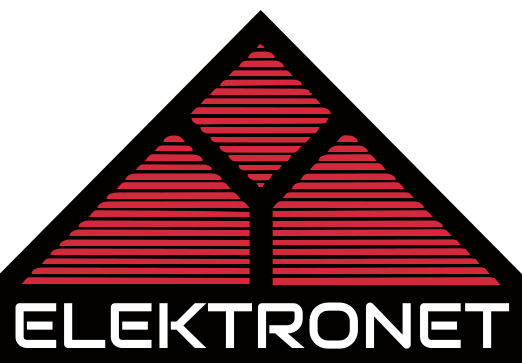

Wewnętrzny system Zespołu Szkół Elektronicznych w Rzeszowie, do zarządzania stypendiami, osiągnięciami, zgłoszeniami, itd.

## Rozwój projektu

Projekt został napisany w języku PHP, przy użyciu frameworka Laravel oraz biblioteki komponentów Filament.

Do większości modyfikacji, typu dodawanie nowych tabel czy funkcjonalności wystarczy zapoznać się z dokumentacją [Filament](https://filamentphp.com/). Można też wzorować się na istniejącym kodzie.

Po wprowadzeniu zmian w kodzie, należy wysłać mi pull request. Po zatwierdzeniu wrzucę nowy kod na serwer w szkole.

## Początkowa konfiguracja i inicjalizacja

- Zainstaluj potrzebne narzędzia
- Stwórz i zaninicjalizuj bazę danych: `php artisan migrate:fresh --seed` (pojawi się konto `kacwyc` z hasłem `admin`)
- Ustaw zmienną środowiskową `APP_LOCALE` na `pl` (można to zrobić w pliku `.env`)
- Ustaw zmienną środowiskową `APP_NAME` na `Elektronet`

## Kontakt

W pierwszej kolejności, proszę kontaktować się z pracownikami szkoły. Można też zgłosić issue na GitHubie. Ewentualnie można napisać do mnie na adres [elektronet@wyczawski.dev](mailto:elektronet@wyczawski.dev).